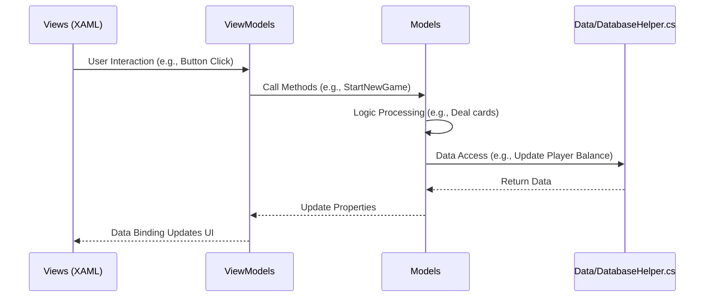

# 🃏 BlackJackApp

This is a simple BlackJack game application built with .NET 8 and WPF. It allows users to play Blackjack against a dealer. The game includes features such as betting, hitting, standing, and determining the game result.

<p align="center">
  
</p>

## ✨ Features

-   Player selection/creation via a database.
-   Basic Blackjack game logic (hit, stand, calculate score, determine winner).
-   WPF-based GUI with animated card display.
-   Betting system.

## 🛠 Tech Stack

-   .NET 8
-   WPF
-   Entity Framework
-   Microsoft SQL Server

## 🗂️ Folder Structure
```
d13young-blackjackapp/
├── App.xaml
├── App.xaml.cs
├── BlackJackApp.csproj
├── Data/
│   └── DatabaseHelper.cs
├── Images/
├── Models/
│   ├── Card.cs
│   ├── Dealer.cs
│   ├── Deck.cs
│   ├── GameManager.cs
│   ├── Player.cs
│   └── RelayCommand.cs
├── Properties/
│   └── launchSettings.json
├── ViewModels/
│   ├── GameStateManager.cs
│   └── MainViewModel.cs
├── Views/
│   ├── MainWindow.xaml
│   ├── MainWindow.xaml.cs
│   ├── PlayerSelectionWindow.xaml
│   ├── PlayerSelectionWindow.xaml.cs
│   └── Styles.xaml
```

## ⚙️ Setup Instructions

1.  **Prerequisites:**
    -   .NET 8 SDK
    -   Microsoft SQL Server (SQLEXPRESS recommended)

2.  **Database Setup:**
    -   Create a database named `BlackJackDB` in your SQL Server instance.
    -   Ensure that the connection string in `Data/DatabaseHelper.cs` (`Server=.\\SQLEXPRESS;Database=BlackJackDB;Trusted_Connection=True;`) matches your SQL Server configuration.
    -   Create a table named `Players` with columns: `PlayerID (INT, IDENTITY)`, `Name (VARCHAR(255))`, and `Balance (INT)`.

3.  **Build and Run:**
    -   Clone the repository.
    -   Open the `BlackJackApp.csproj` in Visual Studio or using the .NET CLI.
    -   Build the project.
    -   Run the application.

## 🏗️ Architecture

The application follows a MVVM (Model-View-ViewModel) pattern.



## 🧩 Models

    Card: Represents a playing card with suit, rank, value and image. (Card.cs)
    Deck: Represents a deck of cards, with functionalities to create, shuffle, and draw cards. (Deck.cs)
    Player: Represents a player with name, balance, and bet amount. (Player.cs)
    Dealer: Represents the dealer, inheriting from the Player class. (Dealer.cs)
    GameManager: Manages the game logic, including dealing cards, calculating scores, and determining the winner. (GameManager.cs)
    RelayCommand: Implements ICommand, allowing binding commands from View to ViewModel. (RelayCommand.cs)

## 🖼️ Views

    MainWindow: The main game window, displaying the game interface. (MainWindow.xaml, MainWindow.xaml.cs)
    PlayerSelectionWindow: Window for selecting or creating a player. (PlayerSelectionWindow.xaml, PlayerSelectionWindow.xaml.cs)
    Styles.xaml: Contains styles and themes for the WPF application. (Styles.xaml)

## 🧠 ViewModels

    MainViewModel: ViewModel for the MainWindow, handling game logic and UI updates. (MainViewModel.cs)
    GameStateManager: Manages the state of the game (CanStart, CanHit, CanStand) and updates related UI elements. (GameStateManager.cs)

## 💾 Data

    DatabaseHelper: Provides helper methods for database operations. (DatabaseHelper.cs)

Made with ❤️ by [D13young]
